# **Praktikum 2 Jaringan Komputer**
<div align=justify>

Berikut adalah Repository dari Kelompok A17 untuk pengerjaan Praktikum Modul 2 Jaringan Komputer. Dalam Repository ini terdapat Anggota Kelompok, Dokumentasi serta Penjelasan tiap soal, Screenshot Output, dan Kendala yang dialami.

# **Anggota Kelompok**

| Nama                      | NRP        | Kelas                |
| ------------------------- | ---------- | ----------------     |
| Andrian                | 5025211079 | Jaringan Komputer A  |
| Akmal Ariq Romadhon       | 5025211188 | Jaringan Komputer A  |

# **Dokumentasi dan Penjelasan Soal**
<div align=justify>

Berikut adalah dokumentasi yang berisi source code dari tiap soal dan penjelasan terkait perintah yang digunakan. 

## **Soal Nomor 1**
Yudhistira akan digunakan sebagai DNS Master, Werkudara sebagai DNS Slave, Arjuna merupakan Load Balancer yang terdiri dari beberapa Web Server yaitu Prabakusuma, Abimanyu, dan Wisanggeni. Buatlah topologi dengan pembagian sebagai berikut. Folder topologi dapat diakses pada drive berikut 

## **Penyelesaian Soal Nomor 1**

## **Soal Nomor 2**
Buatlah website utama pada node arjuna dengan akses ke arjuna.yyy.com dengan alias www.arjuna.yyy.com dengan yyy merupakan kode kelompok.

## **Penyelesaian Soal Nomor 2**

## **Soal Nomor 3**
Dengan cara yang sama seperti soal nomor 2, buatlah website utama dengan akses ke abimanyu.yyy.com dan alias www.abimanyu.yyy.com.

## **Penyelesaian Soal Nomor 3**

## **Soal Nomor 4**
Kemudian, karena terdapat beberapa web yang harus di-deploy, buatlah subdomain parikesit.abimanyu.yyy.com yang diatur DNS-nya di Yudhistira dan mengarah ke Abimanyu.

## **Penyelesaian Soal Nomor 4**

## **Soal Nomor 5**
Buat juga reverse domain untuk domain utama. (Abimanyu saja yang direverse)

## **Penyelesaian Soal Nomor 5**

## **Soal Nomor 6**
Agar dapat tetap dihubungi ketika DNS Server Yudhistira bermasalah, buat juga Werkudara sebagai DNS Slave untuk domain utama.

## **Penyelesaian Soal Nomor 6** 

## **Soal Nomor 7**
Seperti yang kita tahu karena banyak sekali informasi yang harus diterima, buatlah subdomain khusus untuk perang yaitu baratayuda.abimanyu.yyy.com dengan alias www.baratayuda.abimanyu.yyy.com yang didelegasikan dari Yudhistira ke Werkudara dengan IP menuju ke Abimanyu dalam folder Baratayuda.

## **Penyelesaian Soal Nomor 7** 

## **Soal Nomor 8**
Untuk informasi yang lebih spesifik mengenai Ranjapan Baratayuda, buatlah subdomain melalui Werkudara dengan akses rjp.baratayuda.abimanyu.yyy.com dengan alias www.rjp.baratayuda.abimanyu.yyy.com yang mengarah ke Abimanyu.

## **Penyelesaian Soal Nomor 8**
    
## **Soal Nomor 9**
Arjuna merupakan suatu Load Balancer Nginx dengan tiga worker (yang juga menggunakan nginx sebagai webserver) yaitu Prabakusuma, Abimanyu, dan Wisanggeni. Lakukan deployment pada masing-masing worker.

## **Penyelesaian Soal Nomor 9** 
Pada persoalan ini, kita dapat menjalankan langkah-langkah berikut.<br>
1. Kita perlu mengkonfigurasi Arjuna sebagai load balancer.
```bash
    echo nameserver 192.168.122.1 > /etc/resolv.conf

    #Meninstall semua library yang dibutuhkan
    apt-get update
    apt-get install bind9 nginx

    #Membuat folder pada directory nginx/sites-available/lb-jarkom
    touch /etc/nginx/sites-available/lb-jarkom

    #Konfigurasi pada file tersebut
    upstream myweb {
            server 192.177.3.2; #IP Prabakusuma
            server 192.177.3.3; #IP Abimanyu
            server 192.177.3.4; #IP Wisanggeni
    }

    server {
            listen 80;
            server_name arjuna.a17.com www.arjuna.a17.com;

            location / {
            proxy_pass http://myweb;
    }

    #Melakukan sync file pada folder sites-enabled
    ln -s /etc/nginx/sites-available/lb-jarkom /etc/nginx/sites-enable

    #Restart nginx
    service nginx restart
```

2. Melakukan konfigurasi pada tiap-tiap webserver yang akan dijadikan worker.
```bash

    echo nameserver 192.168.122.1 > /etc/resolv.conf

    #Meninstall semua library yang akan digunakan
    apt-get update && apt install nginx php php-fpm -y

    #Membuat folder dan index.php (web yang akan ditampilkan)
    mkdir /var/www/jarkom

    touch /var/www/jarkom/index.php

    #Isi index,php
    echo '
    <?php
    echo "Halo, Kamu berada di Prabukusuma";
    ?>' > /var/www/jarkom/index.php

    #Mengkonfigurasi web yang telah dibuat tadi pada site-availble/jarkom
    touch /etc/nginx/sites-available/jarkom
    echo '
    server {

            listen 80;

            root /var/www/jarkom;

            index index.php index.html index.htm;
            server_name _;

            location / {
                            try_files $uri $uri/ /index.php?$query_string;
            }

            # pass PHP scripts to FastCGI server
            location ~ \.php$ {
            include snippets/fastcgi-php.conf;
            fastcgi_pass unix:/var/run/php/php7.2-fpm.sock;
            }

    location ~ /\.ht {
                            deny all;
            }

            error_log /var/log/nginx/jarkom_error.log;
            access_log /var/log/nginx/jarkom_access.log;
    }' > /etc/nginx/sites-available/jarkom

    #Melakukan sync pada folder sites-enabled
    ln -s /etc/nginx/sites-available/jarkom /etc/nginx/sites-enabled

    rm -rf /etc/nginx/sites-enabled/default

    #Memuat ulang
    service nginx restart
    service php7.2-fpm restart
    service php7.2-fpm start
    service php7.2-fpm status
    nginx -t
```
3. Lakukan hal yang sama pada 2 worker lainnya.
4. Testing
- Pada salah satu Client
```bash
    echo nameserver 192.168.122.2 > /etc/resolv.conf
    apt-get update
    apt-get install lynx

    echo nameserver 192.177.2.3 > /etc/resolv.conf #IP Master
    echo nameserver 192.177.2.2 >> /etc/resolv.conf #IP Slave
    echo nameserver 192.177.1.4 >> /etc/resolv.conf #IP LoadBalancer
    echo nameserver 192.168.122.2 >> /etc/resolv.conf #IP Router

    lynx arjuna.a17.com
``` 
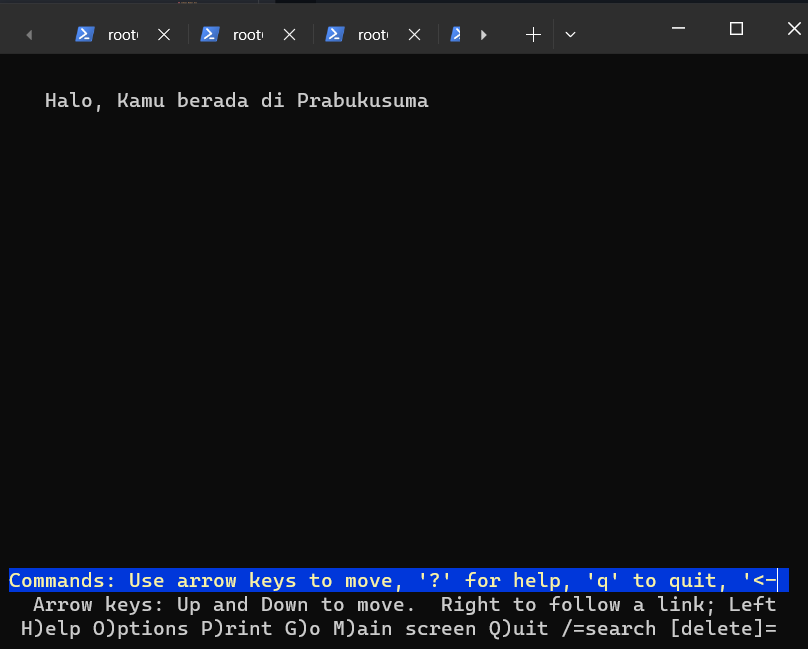
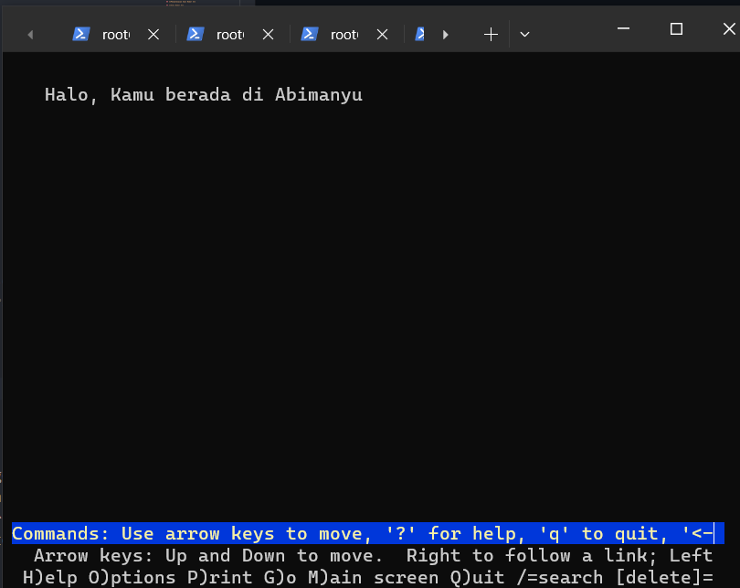
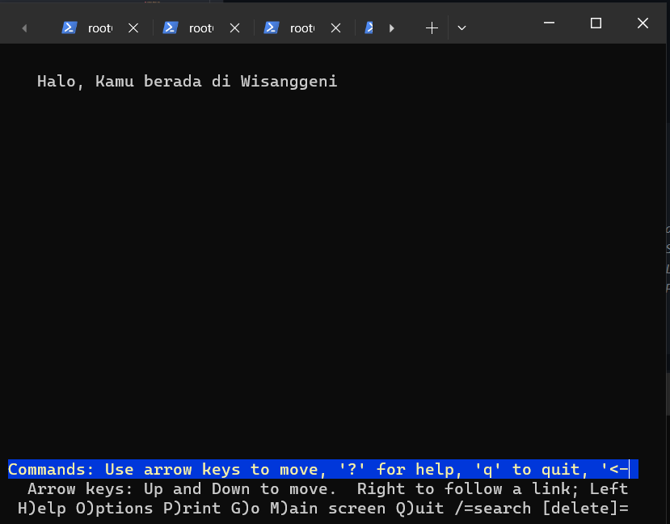


## **Soal Nomor 10**
Kemudian gunakan algoritma Round Robin untuk Load Balancer pada Arjuna. Gunakan server_name pada soal nomor 1. Untuk melakukan pengecekan akses alamat web tersebut kemudian pastikan worker yang digunakan untuk menangani permintaan akan berganti ganti secara acak. Untuk webserver di masing-masing worker wajib berjalan di port 8001-8003. Contoh
- Prabakusuma:8001
- Abimanyu:8002
- Wisanggeni:8003

## **Penyelesaian Soal Nomor 10**
Dengan menggunakan cara pada nomor 9, kita hanya perlu mengganti beberpa hal, yaitu:
- Pada file /etc/nginx/sites-available/jarkom pada Worker
```bash
    Listen 80 -> Listen 8001 #Port yang diinginkan
```
- Pada file /etc/nginx/sites-available/lb-jarkom pada Load Balancer
```bash
    #Menambahkan port pada setiap IP
    server 192.177.3.2:8001;
    server 192.177.3.3:8002;
    server 192.177.3.4:8003;
```
- Testing pada client
```bash
    curl arjuna.a17.com
```
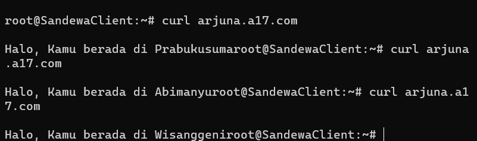

## **Soal Nomor 11**
Selain menggunakan Nginx, lakukan konfigurasi Apache Web Server pada worker Abimanyu dengan web server www.abimanyu.yyy.com. Pertama dibutuhkan web server dengan DocumentRoot pada /var/www/abimanyu.yyy

## **Penyelesaian Soal Nomor 11**
- Melakukan konfigurasi Apache Web Server pada worker Abimanyu terkait site abimanyu.a17.com.
```bash
    #Install apache2
    apt-get install apache2
    #Membuat file konfigurasi
    touch /etc/apache2/sites-available/abimanyu.a17.com.conf
    #Membuat directory untuk menyimpan .php yang akan ditampilkan
    mkdir /var/www/abimanyu.a17

    echo '
    <VirtualHost *:80>
            ServerAdmin webmaster@localhost
            DocumentRoot /var/www/abimanyu.a17
            ServerName abimanyu.a17.com
            ServerAlias www.abimanyu.a17.com

            ErrorLog ${APACHE_LOG_DIR}/error.log
            CustomLog ${APACHE_LOG_DIR}/access.log combined
    </VirtualHost>' > /etc/apache2/sites-available/abimanyu.a17.com.conf

    #Melakukan link pada sites-enabled
    a2ensite abimanyu.a17.com.conf

    #Memuat ulang
    service apache2 reload

    service apache2 restart
```
- Selanjutnya kita mengisi folder /var/www/abimanyu.a17 dengan resource yang didownload dari web.
```bash
    apt-get install wget unzip

    wget 'https://drive.usercontent.google.com/download?id=1a4V23hwK9S7hQEDEcv9FL14UkkrHc-Zc&export=download&authuser=0&confirm=t&uuid=ba803a01-09da-443a-aca9-$unzip -j /var/www/abimanyu.a17/abimanyu.zip -d /var/www/abimanyu.a17

    rm -rf /var/www/abimanyu.a17/abimanyu.zip
    rm -rf /var/www/abimanyu.a17/abimanyu.yyy.com
```
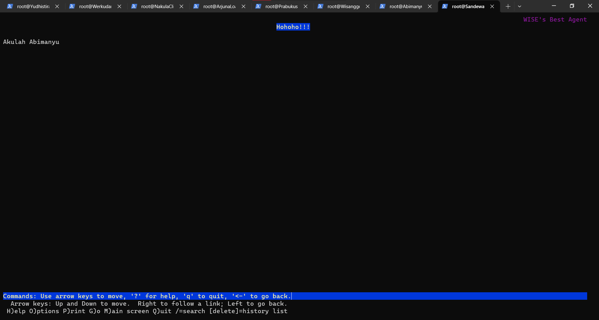

## **Soal Nomor 12**
Setelah itu ubahlah agar url www.abimanyu.yyy.com/index.php/home menjadi www.abimanyu.yyy.com/home.

## **Penyelesaian Soal Nomor 12**
- Dengan menggunakan cara seperti nomor 11, kita hanya perlu menambahkan beberapa konfigurasi pada  /etc/apache2/sites-available/abimanyu.a17.com.conf. 
```bash
    <Directory /var/www/Abimanyu.A17.com>
        RewriteEngine On
        RewriteCond %{REQUEST_FILENAME} !-f
        RewriteCond %{REQUEST_FILENAME} !-d
        RewriteRule ^(.*)$ index.php/$1 [L]
    </Directory>
```
- Melakukan rewrite pada file sync di sites-enabled
```bash
    a2enmod rewrite abimanyu.a17.com.conf
    service apache2 restart
```
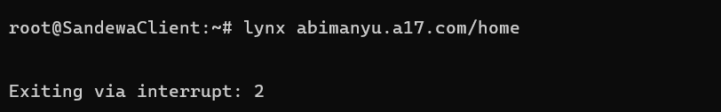
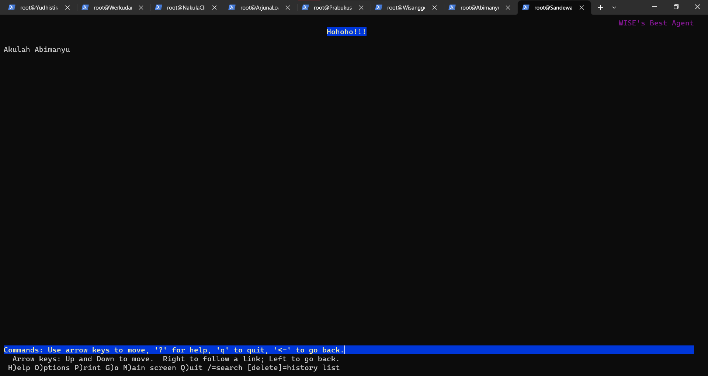

## **Soal Nomor 13**
Selain itu, pada subdomain www.parikesit.abimanyu.yyy.com, DocumentRoot disimpan pada /var/www/parikesit.abimanyu.yyy

## **Penyelesaian Soal Nomor 13**
- Melakukan konfigurasi Apache Web Server pada worker Abimanyu terkait site parikesit.abimanyu.a17.com.
```bash
    #Install library
    apt-get install apache2

    #Membuat file konfigurasi
    touch /etc/apache2/sites-available/parikesit.abimanyu.a17.com.conf
    #Membuat folder untuk site
    mkdir /var/www/parikesit.abimanyu.a17

    #Konfigurasi pada site
    echo '
    <VirtualHost *:80>
            ServerAdmin webmaster@localhost
            DocumentRoot /var/www/parikesit.abimanyu.a17
            ServerName parikesit.abimanyu.a17.com
            ServerAlias www.parikesit.abimanyu.a17.com

            ErrorLog ${APACHE_LOG_DIR}/error.log
            CustomLog ${APACHE_LOG_DIR}/access.log combined
    </VirtualHost>' > /etc/apache2/sites-available/parikesit.abimanyu.a17.com.conf

    #Melakukan ync pada sites-enabled
    a2ensite parikesit.abimanyu.a17.com.conf

    #Memuat Ulang
    service apache2 reload

    service apache2 restart
```
- Selanjutnya kita mengisi folder /var/www/parikesit.abimanyu.a17 dengan resource yang didownload dari web.
```bash
    apt-get install wget unzip

    wget 'https://drive.usercontent.google.com/download?id=1LdbYntiYVF_NVNgJis1GLCLPEGyIOreS&export=download&authuser=0&confirm=t&uuid=7440274a-d695-44db-8cd9-$unzip /var/www/parikesit.abimanyu.a17/parikesit_abimanyu.zip -d /var/www/parikesit.abimanyu.a17

    rm -rf /var/www/parikesit.abimanyu.a17/parikesit_abimanyu.zip
```
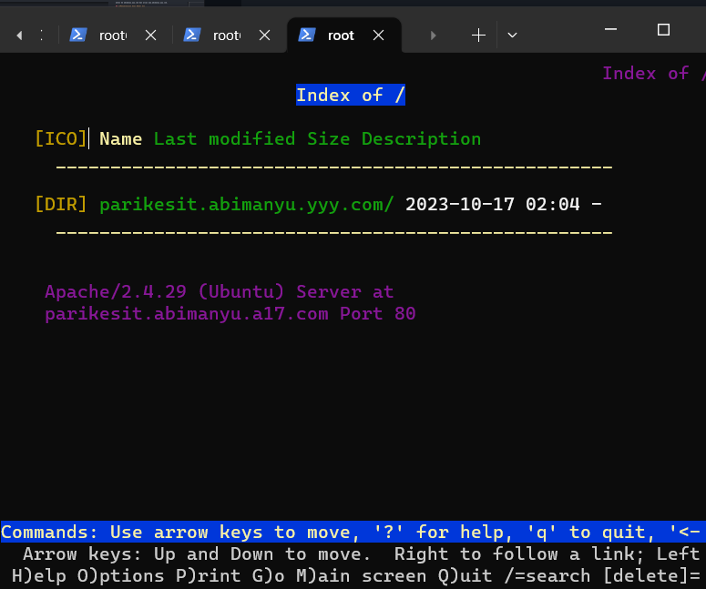

## **Soal Nomor 14**
Pada subdomain tersebut folder /public hanya dapat melakukan directory listing sedangkan pada folder /secret tidak dapat diakses (403 Forbidden).

## **Penyelesaian Soal Nomor 14**
- Menghilangkan subfolder parikesit.abimanyu.yyy.com
```bash
    mv  /var/www/parikesit.abimanyu.a17/parikesit.abimanyu.yyy.com/public  /var/www/parikesit.abimanyu.a17/public
    mv  /var/www/parikesit.abimanyu.a17/parikesit.abimanyu.yyy.com/error  /var/www/parikesit.abimanyu.a17/secret
    rm -rf /var/www/parikesit.abimanyu.a17/parikesit.abimanyu.yyy.com/
```
- Kita hanya perlu menggantikan beberapa konfigurasi pada file .conf pada directory /etc/apache2/sites-available/parikesit.abimanyu.a17.com.conf.
```bash
    <Directory /var/www/parikesit.abimanyu.a17/public>
            Options +Indexes
    </Directory>

    <Directory /var/www/parikesit.abimanyu.a17/secret>
            Options -Indexes
    </Directory>
```
-Testing pada Client
```bash
    lynx parikesit.abimanyu.a17.com
```
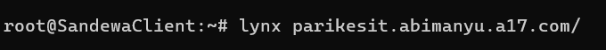
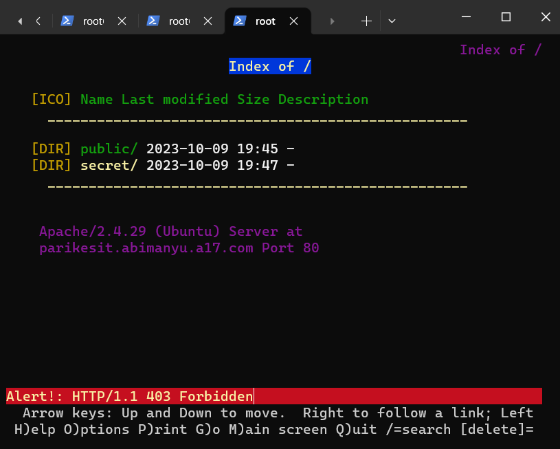

## **Soal Nomor 15**
Buatlah kustomisasi halaman error pada folder /error untuk mengganti error kode pada Apache. Error kode yang perlu diganti adalah 404 Not Found dan 403 Forbidden.

## **Penyelesaian Soal Nomor 15**
- Untuk melakukan hal tersebut, kita dapat menambahkan konfigurasi pada file .conf.
```bash
    ErrorDocument 404 /secret/404.html
    ErrorDocument 403 /secret/403.html
```
- Testing pada Client
```bash
    lynx parkesit.abimanyu.a17.com
    lynx parikesit.abimanyu.a17.com/aaa
```
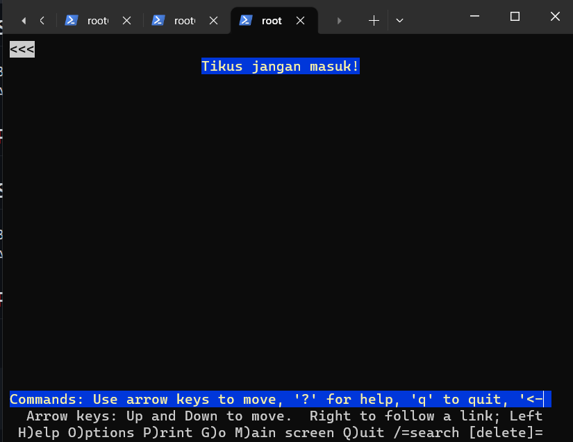


## **Soal Nomor 16**
Buatlah suatu konfigurasi virtual host agar file asset www.parikesit.abimanyu.yyy.com/public/js menjadi www.parikesit.abimanyu.yyy.com/js 

## **Penyelesaian Soal Nomor 16** 
- Kita dapat menambahkan konfigurasi di bawah ini pada file .conf-nya.
```bash
    Alias "/js" "/var/www/parikesit.abimanyu.a17/public/js"
```
- Testing pada Client
```bash
    lynx parikesit.abimanyu.a17.com/js
```
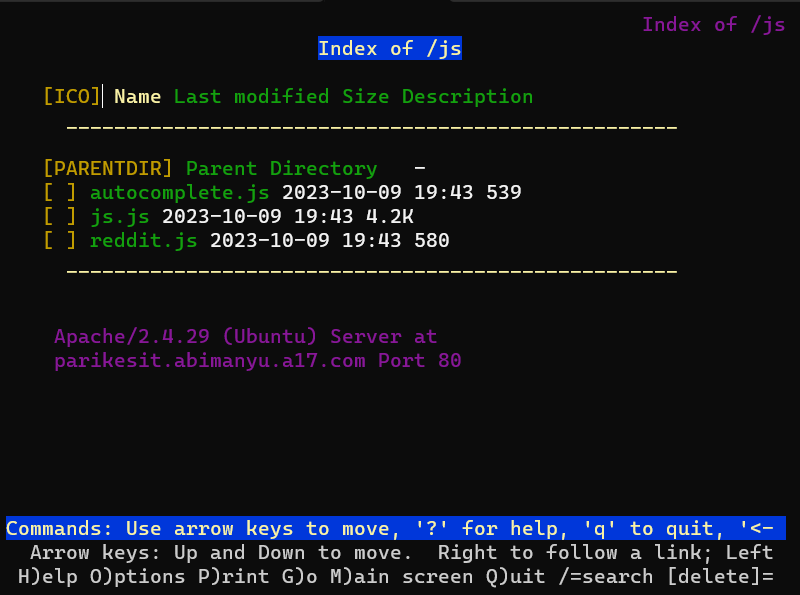

## **Soal Nomor 17**
Agar aman, buatlah konfigurasi agar www.rjp.baratayuda.abimanyu.yyy.com hanya dapat diakses melalui port 14000 dan 14400.

## **Penyelesaian Soal Nomor 17**
- Melakukan konfigurasi seperti soal-soal sebelumnya.
```bash
    #Install apache2
    apt-get install apache2
    #Membuat file konfigurasi
    touch /etc/apache2/sites-available/rjp.baratayuda.abimanyu.a17.com.conf
    #Membuat folder yang menyimpan site
    mkdir /var/www/rjp.baratayuda.abimanyu.a17
    #Melakukan Konfigurasi
    echo '
    <VirtualHost *:14000 *:14400> #Mengganti Port
        ServerAdmin webmaster@localhost
        DocumentRoot /var/www/rjp.baratayuda.abimanyu.a17
        ServerName www.rjp.baratayuda.abimanyu.a17.com
        ServerAlias rjp.baratayuda.abimanyu.a17.com

        ErrorLog ${APACHE_LOG_DIR}/error.log
        CustomLog ${APACHE_LOG_DIR}/access.log combined
    </VirtualHost>'> /etc/apache2/sites-available/rjp.baratayuda.abimanyu.a17.com.conf
```
- Kita dapat melalukan perubahan port pada file .conf-nya.
```bash
    <VirtualHost *:80> -> <VirtualHost *:14000 *:14400>
```
- Menambahkan port pada ports.conf
```bash
    echo '
        Listen 80
        Listen 14000
        Listen 14400

        <IfModule ssl_module>
                Listen 443
        </IfModule>

        <IfModule mod_gnutls.c>
                Listen 443
        </IfModule>' > /etc/apache2/ports.conf
```
- Memuat ulang dan download file yang dibutuhkan
```bash
    service apache2 reload
    service apache2 restart

    apt-get install wget unzip

    wget 'https://drive.usercontent.google.com/download?id=1pPSP7yIR05JhSFG67RVzgkb-VcW9vQO6&export=download&authuser=0&confirm=t&uuid=c039943d-843b-47b9-8910-$unzip -j /var/www/rjp.baratayuda.abimanyu.a17/rjp_baratayuda_abimanyu.zip -d /var/www/rjp.baratayuda.abimanyu.a17

    rm -rf /var/www/rjp.baratayuda.abimanyu.a17/rjp_baratayuda_abimanyu.zip
    rm -rf /var/www/rjp.baratayuda.abimanyu.a17/rjp.baratayuda.abimanyu.yyy.com
```
- Testing pada Client
```bash
    lynx www.rjp.baratayuda.abimanyu.a17.com:14000
    lynx www.rjp.baratayuda.abimanyu.a17.com:14400
```
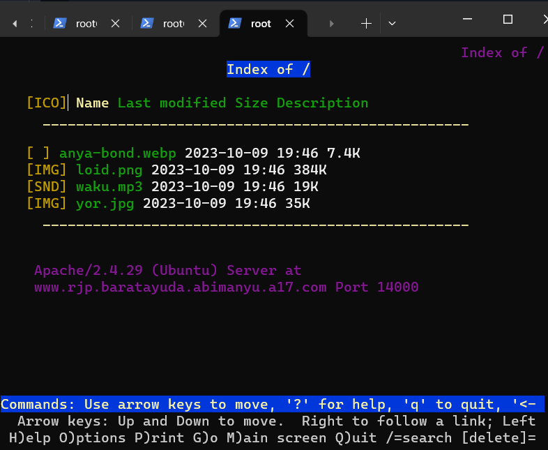
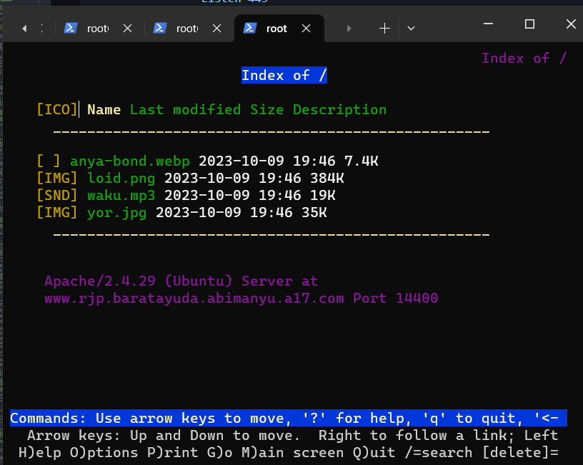

## **Soal Nomor 18**
Untuk mengaksesnya buatlah autentikasi username berupa “Wayang” dan password “baratayudayyy” dengan yyy merupakan kode kelompok. Letakkan DocumentRoot pada /var/www/rjp.baratayuda.abimanyu.yyy.

## **Penyelesaian Soal Nomor 18**
    
## **Soal Nomor 19**
Buatlah agar setiap kali mengakses IP dari Abimanyu akan secara otomatis dialihkan ke www.abimanyu.yyy.com (alias)

## **Penyelesaian Soal Nomor 19** 
    
## **Soal Nomor 20**
Karena website www.parikesit.abimanyu.yyy.com semakin banyak pengunjung dan banyak gambar gambar random, maka ubahlah request gambar yang memiliki substring “abimanyu” akan diarahkan menuju abimanyu.png.

## **Penyelesaian Soal Nomor 20**

# **Kendala Saat Pengerjaan**

# **End of The Line**

```c
#include <stdio.h>

int main(){
    printf("Thank you!");
}
```